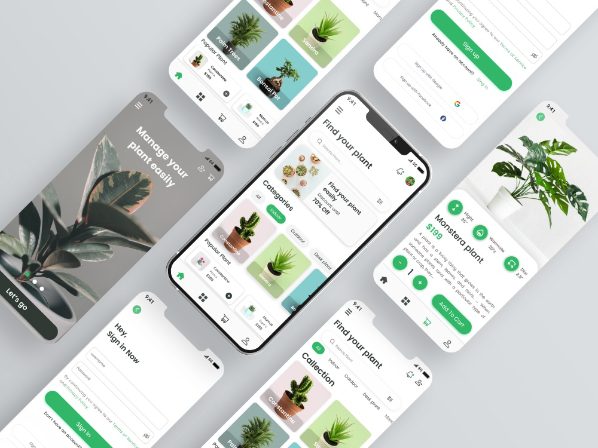
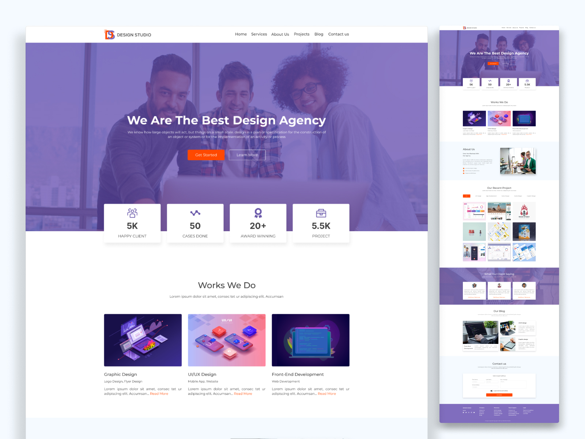

 

                        <!--item -->
                        

                            

                                
                                

                                    <a href="assets/img/works/NFT LandingpageUP.jpg" class="view-work"> View UI/UX
                                        Design Work</a>
                                

                            

                            

                                
NFT Landing Page

                                <a href="./assets/img/Picture/capture.jpg" class="ml-auto" target="block"><i
                                        class="fas fa-external-link-alt"></i>
                                </a>
                            

                        

                    

                    

                        <!--item -->
                        

                            

                                
                                

                                    <a href="assets/img/works/foodapp.png" class="view-work">View UI/UX Design Work</a>
                                

                            

                            

                                
Food App Design

                                <a href="assets/img/works/foodapp.png" class="ml-auto" target="block">
                                    <i class="fas fa-external-link-alt"></i>
                                </a>
                            

                        

                    

                    

                        <!--item -->
                        

                            

                                
                                

                                    <a href="assets/img/works/Travel Agency Landing Page .png" class="view-work">View
                                        UI/UX Design Work</a>
                                

                            

                            

                                
Travel Agency Landing Page

                                <a href="assets/img/works/trHome page.png" class="ml-auto" target="block">
                                    <i class="fas fa-external-link-alt"></i>
                                </a>
                            

                        

                    

                    

                        <!--item -->
                        

                            

                                
                                

                                    <a href="assets/img/works/image_large.png" class="view-work">View UI/UX Design
                                        Work</a>
                                

                            

                            

                                
Plant App Design

                                <a href="assets/img/works/image_large.png" class="ml-auto" target="block">
                                    <i class="fas fa-external-link-alt"></i>
                                </a>
                            

                        

                    

                    

                        <!--item -->
                        

                            

                                
                                

                                    <a href="assets/img/works/Agency_Website.jpg" class="view-work">View UI/UX Design
                                        Work</a>
                                

                            

                            

                                
Agency Website

                                <a href="assets/img/works/Agency-website.png" class="ml-auto" target="block">
                                    <i class="fas fa-external-link-alt"></i>
                                </a>
                            

                        

                    

                    

                        <!--item -->
                        

                            

                                
                                

                                    <a href="assets/img/works/Frame 67.jpg" class="view-work">View UI/UX Design Work</a>
                                

                            

                            

                                
Shopping App Design

                                <a href="assets/img/works/Frame 67.jpg" class="ml-auto" target="block">
                                    <i class="fas fa-external-link-alt"></i>
                                </a>
                            

                        

                    
